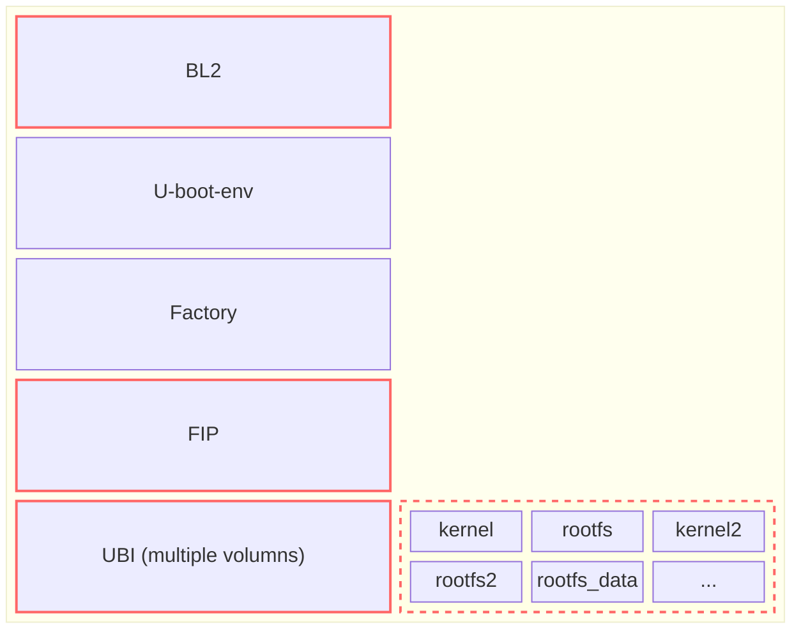
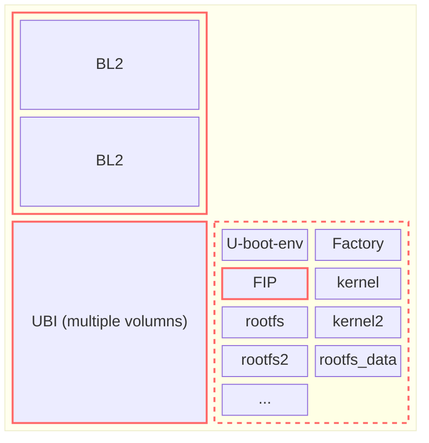

# Mediatek OpenWrt SDK User Guide (Platform Only, Kernel 6.12, OpenWrt master/26.xx)

## Table of Contents
1. [Introduction](#introduction)
2. [Prerequisites](#prerequisites)
3. [Building the Platform Firmware](#building-the-platform-firmware)
    - Clone the Repository
    - Set Up the Autobuild Environment
    - Modify Feed Revisions
    - Build the Target
4. [Bootloader Preparation and Flashing](#bootloader-preparation-and-flashing)
5. [Flashing the Platform Firmware](#flashing-the-platform-firmware)
---

## Introduction

This document provides comprehensive, step-by-step instructions for building the OpenWrt platform firmware for MediaTek devices (kernel 6.12, OpenWrt master/26.xx) using the MediaTek SDK. It is intended for platform-only builds (without Wi-Fi support). The guide covers environment setup, source code acquisition, autobuild usage, bootloader preparation and flashing, and system image generation.

---

## Prerequisites

Before you begin, ensure your build environment meets the following requirements:

- Minimum OS: Ubuntu 22.04
- Essential development tools and libraries, including compilers and build tools.

Refer to the official OpenWrt build system installation guide for more details: https://openwrt.org/docs/guide-developer/toolchain/install-buildsystem

```bash
sudo apt update
sudo apt install build-essential clang flex bison g++ gawk \
gcc-multilib g++-multilib gettext git libncurses-dev libssl-dev \
python3-distutils python3-setuptools rsync swig unzip zlib1g-dev file wget
```

---

## Building the Platform Firmware

### Clone the Repository

Obtain the necessary OpenWrt source code and feeds. For MediaTek platforms, use the latest master/26.xx branch and corresponding feeds.

#### OpenWrt Source

```bash
git clone --branch master https://git.openwrt.org/openwrt/openwrt.git openwrt
cd openwrt
# Checkout to a tested commit if required
git checkout df950f4cfddd6696fe72f51d4260152f08bd643f
cd -
```

#### MediaTek OpenWrt Feeds

```bash
git clone --branch master https://git01.mediatek.com/openwrt/feeds/mtk-openwrt-feeds
cd mtk-openwrt-feeds
cd -
```

### Set Up the Autobuild Environment

The `autobuild_unified` system automates the firmware build process by patching the SDK, preparing configurations, and fetching required packages and feeds.

Navigate to the OpenWrt source directory:

```bash
cd openwrt
```

### Modify Feed Revisions

Update feed revisions in the autobuild configuration file as needed:

```bash
vim ../mtk-openwrt-feeds/autobuild/unified/feed_revision
```

Example:
```bash
packages 9c563686e2a96ccbad4ad51f8aa636c5322e6821
luci 87375a5cf045ac7891eca474919e9e185c734cc3
routing 149ea45cc223597262415823bcdca3effc601bc2
```

### Build the Target

#### One-Step Build

For a pure-platform build (MT7988/MT7987 RFB) with the MediaTek official bootloader:

1. **Initial Build**

   Use the following command to perform a full build for OpenWrt + MediaTek official bootloader:
   ```bash
   bash ../mtk-openwrt-feeds/autobuild/unified/autobuild.sh filogic bootloader=1 log_file=make
   ```

2. **Further Builds After Initial Build**

   For incremental builds, you can use:
   ```bash
   bash ../mtk-openwrt-feeds/autobuild/unified/autobuild.sh build
   ```
   Or use the standard OpenWrt build command for more control:
   ```bash
   make V=s -j24
   ```

---

#### Step-by-Step Build (For Developers)

You can also build the SDK manually, step by step, for more flexibility and debugging.

- **List Supported autobuild_unified Targets:**
  ```bash
  bash ../mtk-openwrt-feeds/autobuild/unified/autobuild.sh list
  ```
  Example output:
  ```
  filogic
  filogic-mac80211
  filogic-mac80211-mozart
  filogic-mac80211-mt7987_rfb
  filogic-mac80211-mt7987_rfb-mt7990
  filogic-mac80211-mt7987_rfb-mt7992
  filogic-mac80211-mt7987_rfb-mt7996
  filogic-mac80211-mt7988_rfb
  filogic-mac80211-mt7988_rfb-mt7992
  filogic-mac80211-mt7988_rfb-mt7996
  ```

- **How autobuild_unified work in prepare stage?**
  
  The autobuild unified system is a multi-level SDK patch/replace script system with inheritance mechanisms and easy-to-use input parameters. The first-level target `filogic` is for pure-platform builds, including most drivers, common packages, and modules. The second-level target `mac80211` adds Wi-Fi (mac80211) kernel modules and packages, and some platform driver patches that may differ by Wi-Fi target. Multi-level targets like `filogic-mac80211-*` inherit the basic platform part from `filogic` and the Wi-Fi part from `mac80211`, with pre-defined configs in child levels. You can use simple build commands to customize the SDK as required.

  for more details, check the scripts in mtk-openwrt-feeds:  
  https://git01.mediatek.com/plugins/gitiles/openwrt/feeds/mtk-openwrt-feeds/+/refs/heads/master/autobuild/unified/autobuild.sh
  https://git01.mediatek.com/plugins/gitiles/openwrt/feeds/mtk-openwrt-feeds/+/refs/heads/master/autobuild/unified/rules
  https://git01.mediatek.com/plugins/gitiles/openwrt/feeds/mtk-openwrt-feeds/+/refs/heads/master/autobuild/unified/scripts/

- **Prepare the SDK for Platform-Only Build:**
  ```bash
  bash ../mtk-openwrt-feeds/autobuild/unified/autobuild.sh filogic prepare
  ```
  This command applies all necessary patches and feeds for a pure-platform SDK.

- **Check Available Input Parameters:**
  ```bash
  bash ../mtk-openwrt-feeds/autobuild/unified/autobuild.sh filogic help
  ```
  This will display all available input parameters for customizing the SDK.

- **Switch to Mediatek Official U-Boot:**  
  To use the Mediatek official U-Boot (with full boot menu and additional support) instead of the OpenWrt official  bootloader, run:
  ```bash
  bash ../mtk-openwrt-feeds/autobuild/unified/autobuild.sh filogic prepare bootloader=1
  ```
  This command applies the necessary patches to use the Mediatek official U-Boot and ATF in `package/boot`.

- **Clean or Reset the SDK:**
  If switching between different targets or configurations, use the `clean` or `fullclean` commands to avoid conflicts.
  ```bash
  bash ../mtk-openwrt-feeds/autobuild/unified/autobuild.sh clean
  ```
  or for a full clean:
  ```bash
  bash ../mtk-openwrt-feeds/autobuild/unified/autobuild.sh fullclean
  ```
  The difference between 'clean' and 'fullclean' is that 'clean' will not re-install feeds that have not changed. Normally, the 'clean' command is sufficient and saves time waiting for long downloads. However, if you suspect the feeds may have residual issues due to a bug, you can use 'fullclean' instead.

- After the SDK is prepared, you can use build command from the autobuild_unified, or just use the openwrt 
  original command
  ```bash
  bash ../mtk-openwrt-feeds/autobuild/unified/autobuild.sh build
  ```
  or just use OpenWrt original build command (e.g: make V=s -j24)

- Additionally, a release script is available to collect the required images into the `./autobuild_release` folder.
  After building, use the following command to collect the relevant images from the build results:
  ```bash
  bash ../mtk-openwrt-feeds/autobuild/unified/autobuild.sh release
  ```

## Bootloader Preparation and Flashing

This section provides a detailed guide for preparing and flashing the bootloader (U-Boot and ATF) on MT7988/MT7987 RFB platforms, including BananaPi BPI-R4 Lite.

### U-Boot & ATF Requirements

The MediaTek official ATF/U-Boot build flow is integrated into the release SDK.
To use the MediaTek official U-Boot (with full boot menu and additional support) instead of the OpenWrt official MediaTek bootloader, run the following command during the prepare stage.
(For One-Step Build, this is included in the one-step command; no extra settings are needed.)

```bash
bash ../mtk-openwrt-feeds/autobuild/unified/autobuild.sh filogic prepare bootloader=1
```
This command applies the necessary patches to use the MediaTek official U-Boot and ATF in `package/boot`.

After the SDK has been prepared with `bootloader=1` at least once,
you can use the following commands to build and collect MediaTek official ATF and U-Boot images:

- **Build BL2/BL31 images:**  
  Clean the build directory if needed:
  ```bash
  rm -rf build_dir/target-aarch64_cortex-a53_musl/arm-trusted-firmware-mediatek-mt798*
  rm staging_dir/target-aarch64_cortex-a53_musl/image/*
  ```
  Build ATF for all targets:
  ```bash
  make package/boot/arm-trusted-firmware-mediatek/compile -j24
  ```
  You can also build a specific variant with the following command:
  ```bash
  make package/boot/arm-trusted-firmware-mediatek/compile -j24 BUILD_VARIANT=mt7987-spim-nand0-ubi-comb
  ```
  Supported variants are listed below:
  ```txt
        mt7987-emmc-comb
        mt7987-nor-comb
        mt7987-sdmmc-comb
        mt7987-spim-nand0-nmbm-comb
        mt7987-spim-nand2-nmbm-comb
        mt7987-spim-nand0-ubi-comb
        mt7987-spim-nand2-ubi-comb
        mt7987-ram-comb
        mt7988-emmc-ddr3
        mt7988-nor-ddr3
        mt7988-sdmmc-ddr3
        mt7988-snand-ddr3
        mt7988-spim-nand-ddr3
        mt7988-emmc-ddr4
        mt7988-nor-ddr4
        mt7988-sdmmc-ddr4
        mt7988-snand-ddr4
        mt7988-spim-nand-ddr4
        mt7988-ram-comb
        mt7988-ram-ddr4
        mt7988-emmc-comb
        mt7988-nor-comb
        mt7988-sdmmc-comb
        mt7988-snand-comb
        mt7988-snand-ubi-comb
        mt7988-spim-nand-comb
        mt7988-spim-nand-ubi-comb
        mt7988-spim-nand-ubi-ddr4
  ```

  The output images are located in `staging_dir/target-aarch64_cortex-a53_musl/image/`.

- **Build FIP images:**  
  Please ensure that BL2/BL31 images exist under `staging_dir/target-aarch64_cortex-a53_musl/image/`,
  or the build will fail due to missing images required for generating FIP images. Build BL2/BL31 first,
  then build FIP to ensure all required images exist in the SDK.

  Clean the build directory if needed:
  ```bash
  rm -rf build_dir/target-aarch64_cortex-a53_musl/uboot-mediatek-filogic-official-release-mt798*
  rm staging_dir/target-aarch64_cortex-a53_musl/image/*fip*
  ```

  Build U-Boot for all targets:
  ```bash
  make package/boot/uboot-mediatek/compile -j24
  ```

- **Collect bootloader images:**  
  By default, bootloader-related images are stored in `./staging_dir/target-aarch64_cortex-a53_musl/image`.
  If you want to collect bootloader images into `./autobuild_release`, you also need to specify the `bootloader` parameter for the release command:
  ```bash
  bash ../mtk-openwrt-feeds/autobuild/unified/autobuild.sh release bootloader=1
  ```


#### Key Differences to OpenWrt Official U-boot

- MediaTek’s official U-Boot includes advanced features (dual-FIP, secure boot, image verification).
- OpenWrt official U-Boot uses environment-based boot menus for flexible recovery and device switching.
- UBI usage differs between MediaTek and OpenWrt builds; switching between bootloaders may require re-flashing.

---

### Flashing Bootloader Images

This section describes how to flash the bootloader to the MT7988/MT7987.

#### SPIM-NAND Procedure

There are two flash layouts for SPIM-NAND bad-block management.
One is NMBM, which is MediaTek's original bad block management mechanism for Filogic SoCs.
NMBM is used in OpenWrt-21.02 SDK and OpenWrt-24.10 SDK.

NMBM operates above the MTD layer and provides logical NMBM MTD partitions.
The UBI partition is for the OpenWrt image and uses one UBI partition with multiple volumes (kernel, rootfs, etc.).
For the bootloader itself, logical NMBM blocks are used for erase/read/write.
The `mtd list` result shows how the partitions are configured.

NMBM MTD layout:
```txt
MT7987> mtd list
List of MTD devices:
* spi-nand0
  - device: spi_nand@0
  - parent: spi@11007800
  - driver: spi_nand
  - path: /soc/spi@11007800/spi_nand@0
  - type: NAND flash
  - block size: 0x20000 bytes
  - min I/O: 0x800 bytes
  - OOB size: 64 bytes
  - OOB available: 24 bytes
  - 0x000000000000-0x000008000000 : "spi-nand0"
* nmbm0
  - type: Unknown
  - block size: 0x20000 bytes
  - min I/O: 0x800 bytes
  - OOB size: 64 bytes
  - OOB available: 24 bytes
  - 0x000000000000-0x000007800000 : "nmbm0"
          - 0x000000000000-0x000000100000 : "bl2"
          - 0x000000100000-0x000000180000 : "u-boot-env"
          - 0x000000180000-0x000000580000 : "factory"
          - 0x000000580000-0x000000780000 : "fip"
          - 0x000000780000-0x000007800000 : "ubi"
```

This figure shows the flash layout of the NMBM bad-block solution:





The NMBM-based image is output here after the autobuild script finishes:

BL2
- `autobuild_release/filogic/mt7987-spim-nand0-nmbm-comb-bl2-*.img`
- `autobuild_release/filogic/mt7988-spim-nand-comb-bl2-*.img`

FIP
- `autobuild_release/filogic/mt7987_rfb-spim-nand-nmbm-u-boot-*.fip`
- `autobuild_release/filogic/mt7988_rfb-spim-nand-nmbm-u-boot-*.fip`

The other is the FULL-UBI bad-block solution

```txt
MT7987> mtd list
List of MTD devices:
* spi-nand0
  - device: spi_nand@0
  - parent: spi@11007800
  - driver: spi_nand
  - path: /soc/spi@11007800/spi_nand@0
  - type: NAND flash
  - block size: 0x20000 bytes
  - min I/O: 0x800 bytes
  - OOB size: 64 bytes
  - OOB available: 24 bytes
  - 0x000000000000-0x000008000000 : "spi-nand0"
          - 0x000000000000-0x000000200000 : "bl2"
          - 0x000000200000-0x000008000000 : "ubi"
```

This figure shows the flash layout of the FULL-UBI bad-block solution:


The FULL-UBI-based image is output here after the autobuild script finishes:

BL2
- `autobuild_release/filogic/mt7987-spim-nand0-ubi-comb-bl2-*.img`
- `autobuild_release/filogic/mt7988-spim-nand-ubi-comb-bl2-*.img`

FIP
- `autobuild_release/filogic/mt7987_rfb-spim-nand-u-boot-*.fip`
- `autobuild_release/filogic/mt7988_rfb-spim-nand-u-boot-*.fip`

 

To flash the bootloader using the MediaTek U-Boot boot menu:
1. **BL2 Upgrade:**
   Flash the `bl2` file matching your DRAM type using the "`Upgrade ATF BL2`" option in the U-Boot menu.
2. **FIP Upgrade:**
   Program the `flp` file using the "`Upgrade ATF FIP`" option in the U-Boot menu.

---
> **Note:** Only NMBM-based U-Boot supports flashing NMBM-based FIP/BL2 directly from the boot menu, and only FULL-UBI-based U-Boot supports flashing FULL-UBI-based FIP/BL2 directly from the boot menu.
Except for the single image case, the single image is a binary that includes all images and filesystem raw data for a flash programmer, which can be directly written to the flash.
In the NMBM case, you can use `dd` to follow the layout and generate a single image including BL2/FIP and zero padding for factory/U-Boot-env.
In the FULL-UBI case, you can only use `dd` to fill the BL2 partition, and need to use UBI-related commands to pack FIP/U-Boot-env/factory into UBI volumes and pack the entire UBI image into the UBI partition on the flash layout.
If you have the correct image provided by MediaTek or built yourself, you can use the `mtd` command to erase the entire flash and write the new single image binary data, or use the MediaTek U-Boot boot menu to directly upgrade a single image. The boot menu option "`Upgrade single image`" can help with this.

---

#### EMMC Procedure

1. **Partition Table Update:**
   Update the partition table by programming `GPT_EMMC_mt798x_itb` via the "`Upgrade partition table`" option.
The partition layout in the GPT table:

```json
{
    "u-boot-env" : {
        "start": 8192,
        "end" : 16383,
        "part_type_guid" : "{3de21764-95bd-54bd-a5c3-4abe786f38a8}"
    },
    "factory" : {
        "start": 16384,
        "end" : 24575
    },
    "fip": {
        "start": 24576,
        "end" : 32767
    },
    "firmware" : {
        "start": 32768,
        "end" : 557055
    }
}
```

2. **BL2 Upgrade:**
   Flash the `bl2` file matching your DRAM type using the "`Upgrade ATF BL2`" option in the U-Boot menu.
3. **FIP Upgrade:**
   Program the `flp` file using the "`Upgrade ATF FIP`" option in the U-Boot menu.

---
## Flashing the OpenWrt Firmware

OpenWrt Image:
- `autobuild_release/filogic/openwrt-mediatek-filogic-mediatek_mt7987a-rfb-squashfs-sysupgrade-*.itb`
- `autobuild_release/filogic/openwrt-mediatek-filogic-mediatek_mt7988a-rfb-squashfs-sysupgrade-*.itb`

Use the boot menu option "`Upgrade firmware`" to upgrade the ITB image.
After the flash write is complete, you must configure the device tree (DT) overlay settings in U-Boot at least once. These settings will persist until U-Boot is replaced. When upgrading to a new SDK OpenWrt image for the first time, reboot once and return to the U-Boot menu to configure the DT overlay settings. This can be done via the boot menu option "`Change boot configuration`" or by directly setting environment variables after the OpenWrt firmware upgrade.

These images are suitable for SPIM-NAND (Full-UBI), SPIM-NAND (NMBM), and EMMC boot devices. You should adjust the DT overlay settings according to the U-Boot image type.

**Example configuration:**

**MT7987 — Flash part**
*   **Boot from NAND Flash (FULL-UBI):** `mt7987-spim-nand`
*   **Boot from NAND Flash (NMBM):** `mt7987-spim-nand-nmbm`
*   **Boot from NOR Flash:** `mt7987-spim-nor`
*   **Boot from eMMC:** `mt7987-emmc`
*   **Boot from SD Card:** `mt7987-sd`

**MT7987 — Networking part**
```txt
Append mt7987-netsys-eth0-an8801sb
Append mt7987-netsys-eth0-an8855-gsw
Append mt7987-netsys-eth0-e2p5g
Append mt7987-netsys-eth0-mt7531
Append mt7987-netsys-eth0-mt7531-gsw
Append mt7987-netsys-eth2-an8801sb
Append mt7987-netsys-eth2-e2p5g
Append mt7987-netsys-eth2-sfp
```
Configuration can be carried out via the boot menu option "`Change boot configuration`" or by directly setting environment variables.

**Example:**
```bash
setenv bootconf mt7987-spim-nand-nmbm
setenv bootconf_extra mt7987-netsys-eth0-an8855#mt7987-netsys-eth1-i2p5g#mt7987-netsys-eth2-usb
```

**MT7988 — Flash part**
*   **Boot from NAND Flash (FULL-UBI):** `mt7988a-rfb-spim-nand`
*   **Boot from NAND Flash (NMBM):** `mt7988a-rfb-spim-nand-nmbm`
*   **Boot from NOR Flash:** `mt7988a-rfb-spim-nor`
*   **Boot from eMMC:** `mt7988a-rfb-emmc`
*   **Boot from SD Card:** `mt7988a-rfb-sd`

**MT7988 — Networking part**
```txt
mt7988a-rfb-emmc.dtso
mt7988a-rfb-eth0-gsw.dtso
mt7988a-rfb-eth1-an8831x.dtso
mt7988a-rfb-eth1-aqr.dtso
mt7988a-rfb-eth1-cux3410.dtso
mt7988a-rfb-eth1-i2p5g-phy.dtso
mt7988a-rfb-eth1-mxl.dtso
mt7988a-rfb-eth1-sfp.dtso
mt7988a-rfb-eth2-an8831x.dtso
mt7988a-rfb-eth2-aqr.dtso
mt7988a-rfb-eth2-cux3410.dtso
mt7988a-rfb-eth2-mxl.dtso
mt7988a-rfb-eth2-sfp.dtso
```

---
## Release Note
| Revision | Date       | Author   | Description     |
|:---      |:---        |:---      |:---             |
| v1.0     | 2025/10/28 | Sam Shih | Initial Version |
